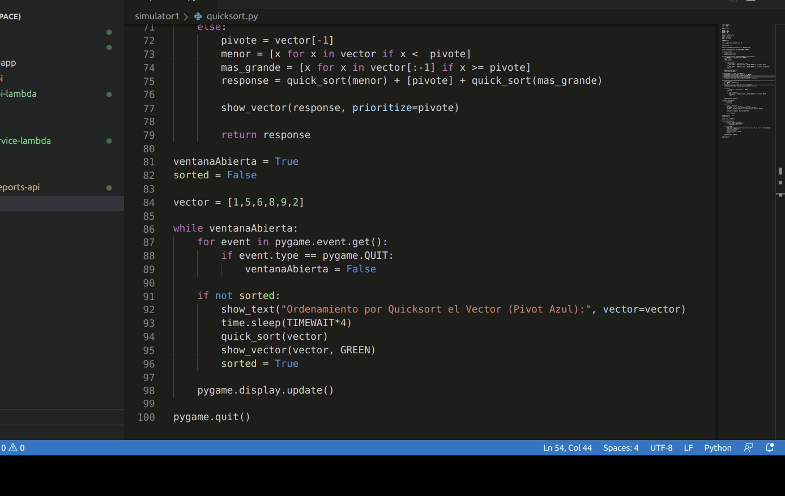

# sort-script
Algoritmos de ordenamiento

## Instalacion
1. Crear un virtualenvironment para python 3:
```
virtualenv -p python3 environments/ve_pygame
```

2. Instalar pygame:
```
pip install pygame
```

## Ejecución
pithon quicksort.py

